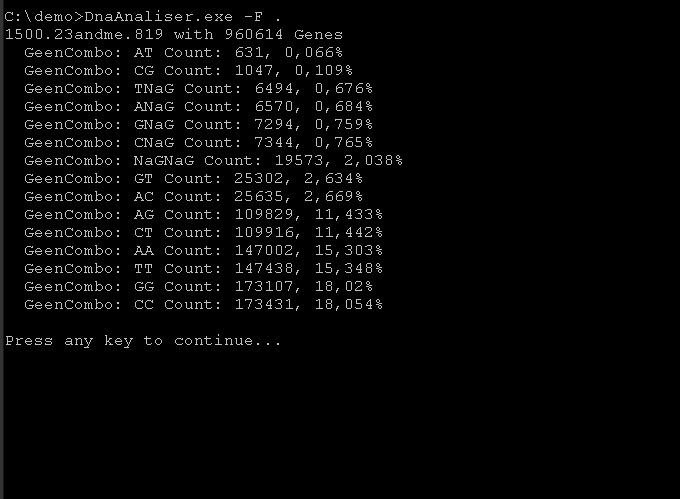

# Gen Analiser

### Primaraly made for 23andme files

#### How to use:
  * From Source:
    * Clone it:
      * `` git clone https://github.com/branc116/DnaAnaliser ``
    * Build it: 
      * `` msbuild DnaAnaliser.sln `` or `` xbuild DnaAnaliser.sln ``
    * Locate it:
      * `` cd DnaAnaliser\bin\x64\Release `` or `` cd DnaAnaliser/bin/x64/Release ``
  * Binarys:
    * To be added
  * Run it:		
    * `` DnaAnaliser.exe [-F folder in where the 23andme files are] | [23andme file]``

#### Madeby:
  * Branimir Ričko
  * rickobranimir@gmail.com

#### License:
  [Apache License](License.md)